<h1>Juego de la serpiente</h1>

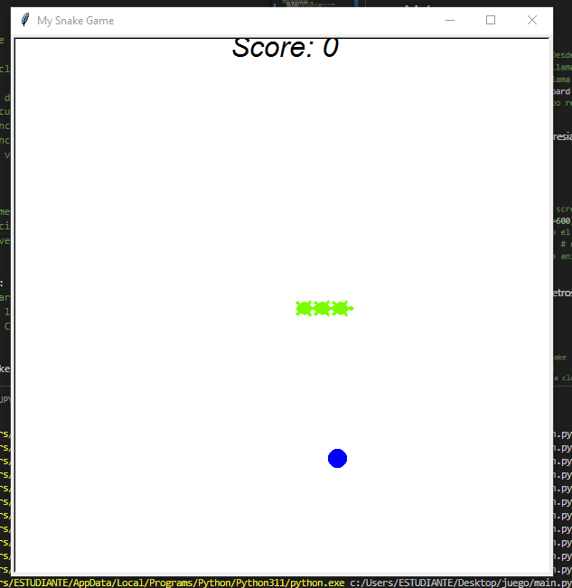

- En este proyecto se creo el juego de la culebrita o snake game utilizando python y la libreria de trutle

<h2>Main</h2>

<h3>Importaciones</h3>
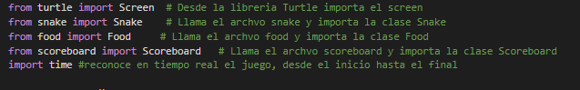

- Esta seccion agrega datos de librerias y archivos creados dentro de un mismo proyecto.

<h3>Ventana</h3>
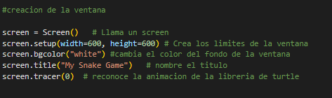

- Esta seccion modifica los parametros de la ventana de juego.

<h3>Funcionalidad</h3>
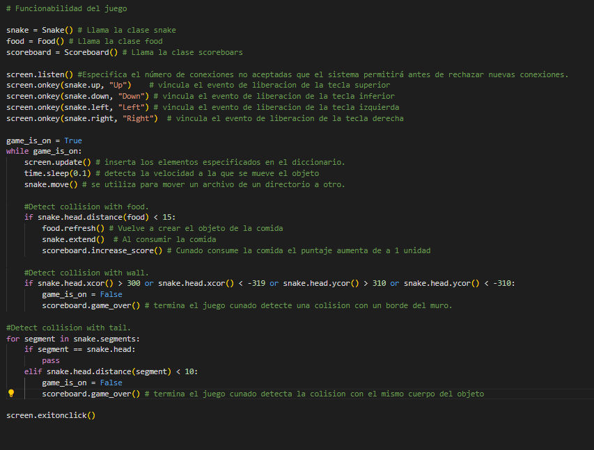

- Esta seccion diseña el funcionamiento del juego detectando coisiones, aumneto de puntaje, aumneto de tamaño del personaje y cuando consume un objeto para aumentar su tamaño.

<h2>Food</h2>

<h3>Importaciones</h3>
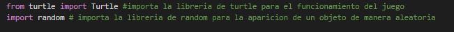

- Esta seccion agrega datos de librerias y archivos creados dentro de un mismo proyecto.

<h3>Funcionalidad</h3>
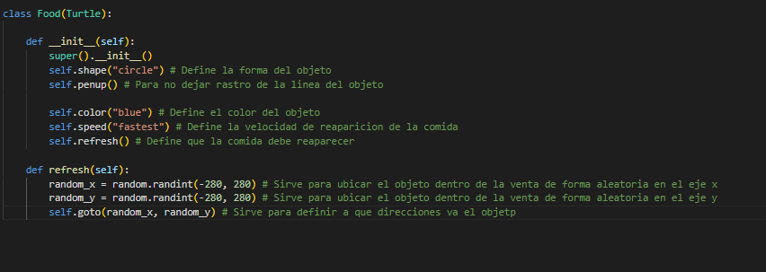

- Esta seccion diseña el funcionamiento de la comida del juego asi mostrando como aparece y su diseño

<h2>Scoreboard</h2>

<h3>Importaciones</h3>
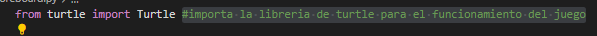

- Esta seccion agrega datos de librerias y archivos creados dentro de un mismo proyecto.

<h3>Variables</h3>
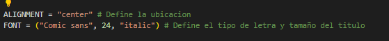

- se crea variables que tendran juego dentro del proyecto.

<h3>Funcionalidad</h3>
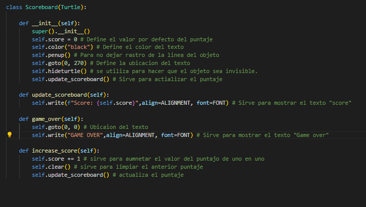

- En esta seccion recnoce como va a funcionar el marcador teniendo en cuenta los parametros establecidos de diseño.

<h2>Snake</h2>

<h3>Importaciones</h3>
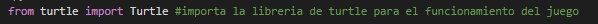

- Esta seccion agrega datos de librerias y archivos creados dentro de un mismo proyecto.

<h3></h3>
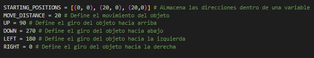

- se crea variables que tendran juego dentro del proyecto.

<h3>Diseño</h3>
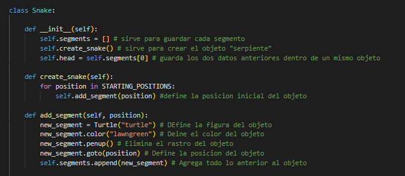

- Esta seccion tiene en cuenta el diseño del objeto y como funcionaria

<h3></h3>
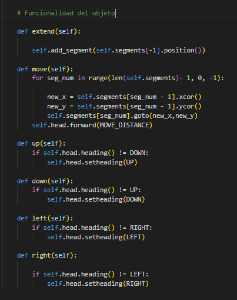

- En esta seccion recnoce como va a funcionar el objeto teniendo en cuenta los parametros establecidos de funcion.

